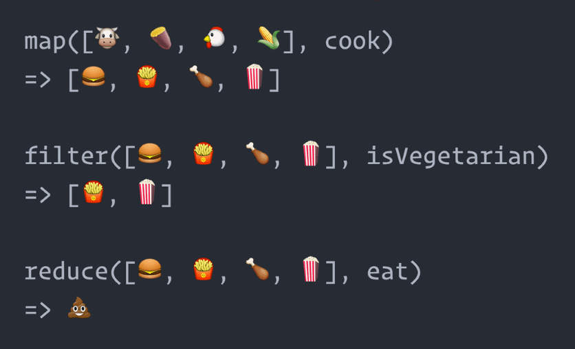
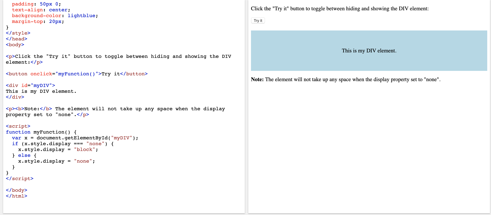
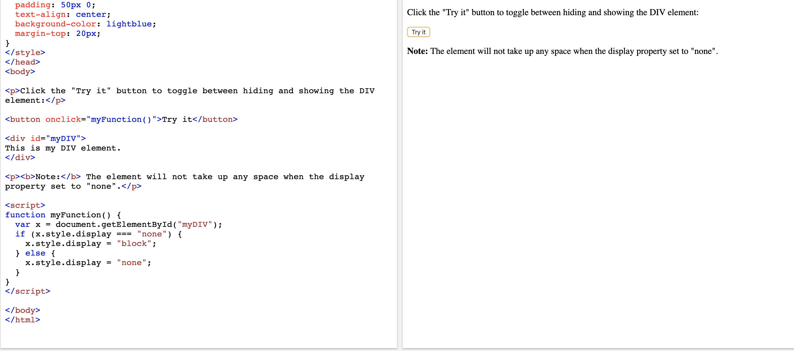

# week-11

# WEEK 11 a few more to go

During the first few days of week 11 we learned how to create a to-do list app by using DOM, toggle, creating elements, mapping and filtering.

# Mapping

Filtering : Whenever you have to filter an array Javascript inbuilt method to filter your array is the right choice to use. Filter let you provide a callback for every element and returns a filtered array.

Mapping:Map like filter takes a callback and run it against every element on the array but whats makes it unique is it generate a new array based on your existing array.

# Toggle

The toggle() method toggles between hide() and show() for the selected elements. This method checks the selected elements for visibility. show() is run if an element is hidden. hide() is run if an element is visible 

In the image below you can see a visual of a block. Once i press the button above the block the image should hide itself

button once clicked

